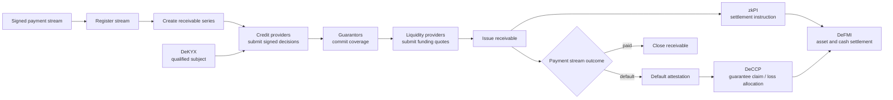
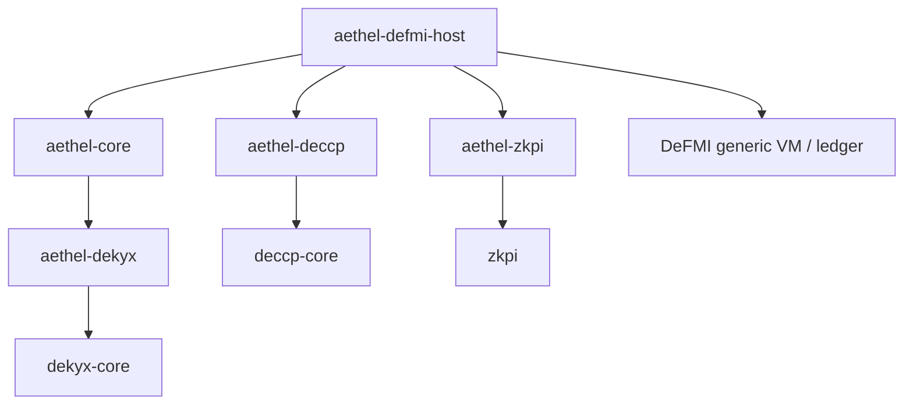

# Aethel — Programmable Payment-Stream Receivables

Aethel turns a signed payment stream into a financeable receivable and lets
independent providers supply credit assessment, guarantees, funding, and
servicing around it.

The central idea is that the **payment stream itself becomes the receivable**.
Aethel does not hard-code one lender, rating model, guarantor, or marketplace.
Providers join through explicit capabilities, sign the artifacts they are
responsible for, and can be replaced or combined without changing the stream's
underlying payment semantics.

This repository contains the deterministic Rust state machine for that process.
It is a research implementation and has not been audited for production use.

## What Aethel provides

- Registration and versioned state transitions for signed payment streams.
- Receivable series that define which streams may be financed and under what
  policy.
- Signed credit decisions bound to one receivable context.
- Guarantees with explicit loss layers and lifecycle states.
- Competing funding quotes from independent liquidity providers.
- Receivable issuance, default attestation, guarantee claim, and release.
- Provider registration, capability separation, suspension, revocation, and
  key rotation.
- Anonymous qualification checks through DeKYX, without storing a legal name in
  the Aethel record.

Aethel records the commercial meaning and lifecycle of a receivable. It does
not hold cash, securities, or legal title. Those authoritative assets and their
settlement remain in DeFMI.

## End-to-end flow



The diagram shows the full deployment model. The `aethel-core` crate owns the
stream and receivable state transitions. DeKYX, DeCCP, zkPI, and DeFMI are
separate modules connected by the host application.

## Open provider model

Every provider is registered with one or more narrowly scoped capabilities:

| Capability | Responsibility |
|---|---|
| `StreamAttestor` | Attest that a payment stream and its updates are valid |
| `CreditAssessor` | Sign a credit decision for an eligible receivable |
| `Guarantor` | Commit a guarantee backed by an external facility |
| `LiquidityProvider` | Submit an executable funding quote |
| `Servicer` | Perform permitted servicing actions |
| `CredentialIssuer` | Vouch for a DeKYX issuer key without becoming a lender or guarantor |

Capabilities do not imply one another. A credit assessment cannot silently act
as a guarantee, and a guarantor cannot issue a funding quote unless separately
authorized. Providers may be suspended or permanently revoked. Key rotation
keeps artifacts signed while an older key was valid verifiable, while rejecting
new artifacts under that retired key.

## Core state model

`AethelBook` is the validated aggregate state. Its main records are:

- `RegisteredStream` and `StreamState`
- `ReceivableSeries` and `SeriesPolicy`
- `CreditDecision`
- `GuaranteeCommitment` and `GuaranteeRelease`
- `FundingQuote`
- `ReceivableIssuance`
- `DefaultAttestation` and `GuaranteeClaim`
- `ProviderDefinition`

Operations carry stable identifiers, validity windows, nonces, policy digests,
and signatures. State transitions reject duplicate operations, unexpected
versions, invalid provider capabilities, expired artifacts, and inconsistent
series or stream references.

## Qualification and confidentiality

A series may require an anonymous DeKYX presentation before a credit decision
or guarantee is accepted. The presentation is bound to the exact Aethel domain,
action, unsigned artifact statement, nonce, and expiration. A valid proof for
one decision cannot be replayed for a different decision or guarantee.

Aethel stores only the verified subject-line binding returned by DeKYX. The
credential, revocation policy, issuer keys, selective-disclosure proof, and
presentation replay ledger remain DeKYX responsibilities.

## Guarantees and settlement

Aethel defines what a guarantee covers and how it relates to a receivable.
DeCCP owns the guarantee facility and its remaining capacity. A deployment can
reserve a DeCCP hold when the guarantee is accepted, bind the hold when the
receivable is issued, and release or consume it when the obligation closes.

The guarantee amount may remain confidential. In that mode, Aethel and DeCCP
exchange commitments, state digests, identifiers, and verified transition
receipts instead of a plaintext amount.

When issuance or a claim moves assets, the host creates a typed zkPI and asks
DeFMI to settle it. Aethel changes its final state only after the corresponding
settlement evidence has been validated by the host.

## Dependencies and integration

Dependencies are deliberately separate from Aethel's product definition.



| Module | Relationship |
|---|---|
| `dekyx-core` | Direct Rust dependency used for issuer directories and verified presentations |
| `aethel-dekyx` | Application-owned adapter for DeKYX presentation and artifact binding |
| `aethel-deccp` | Application-owned guarantee adapter over `deccp-core`; not imported by `aethel-core` |
| `aethel-zkpi` | Receivable context, verification extension and wire format over generic zkPI |
| `aethel-defmi-host` | Application runtime and dedicated binary over DeFMI's generic consensus host |

The core crate can be embedded in any deterministic host that supplies durable
state, authorization, and the external verification ports required by its
deployment. Integration with one chain or one credit provider is not built into
the Aethel domain model.

## Complete product layout

This workspace contains eight business crates and four application-owned integration
crates. The integration crates use the sibling `../defmi` checkout; use matching
revisions of both repositories when building this source tree. A
deliberately reduced, core-only downstream package would contain only
`crates/aethel-core`; such a package would not provide the tokenization,
distribution, obligation-wallet, servicing, or composition paths.

```text
crates/
├── aethel-types/              Shared identifiers, digests, time and signature checks
├── aethel-provider-sdk/       Provider capabilities and signed artifacts
├── aethel-core/               Stream, receivable, guarantee and issuance semantics
├── aethel-tokenization/       Supply caps and external-ledger mint/burn intents
├── aethel-distribution/       Circulation admission, venue fills and settlement binding
├── aethel-obligation-wallet/  Bounded pre-authorization and payment retry queue
├── aethel-servicing/          Payment evidence, delinquency, cure and default evidence
├── aethel/                    Business composition boundary and end-to-end tests
├── aethel-dekyx/              Qualification adapter owned by Aethel
├── aethel-deccp/              Guarantee adapter owned by Aethel
├── aethel-zkpi/               Receivable proof context and wire format
└── aethel-defmi-host/         Application runtime and dedicated VM binary
```

Use `cargo metadata --locked --no-deps --format-version 1` as the authoritative
package inventory. A layout diagram is not evidence that a crate was shipped.

## Enterprise PoC

[Enterprise PoC guide (Japanese)](docs/ENTERPRISE_POC_JA.md) covers signed
payment streams, external credit providers, guarantees, funding, tokenization,
servicing, zkPI/DeFMI settlement, rejection tests and acceptance criteria.

[Foundation independence and migration](docs/FOUNDATION_INDEPENDENCE_JA.md)
describes ownership, the generic RPC envelope and snapshot compatibility.

## Build and verification

Run the checks on Linux with the locked dependency graph:

```sh
cargo test --workspace --locked
cargo clippy --workspace --all-targets --locked -- -D warnings
cargo fmt --all -- --check
cargo build --workspace --release --locked
```

Passing these four gates is not a substitute for an independent cryptographic,
financial, Rust state-machine, host-VM, and integration audit.

## Current limits

- The current anonymous credential contract is scope-pseudonymous; it does not
  claim issuer-unlinkable credentials.
- Cross-issuer anti-Sybil policy requires a shared governance or registry
  decision outside this crate.
- Guarantee claims and releases currently target full-cover transitions; more
  granular partial transitions require an extended state model.
- Legal assignment, perfection, tax, accounting, and bankruptcy treatment of a
  receivable remain deployment-specific.
