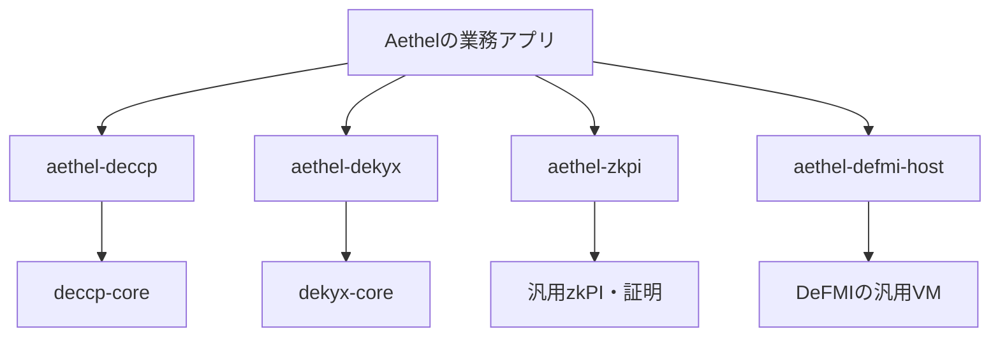

# Aethelと金融基盤の依存方向

更新日: 2026-09-05。ユーザーの「基盤全体からAethel依存をなくす」を、この作業ツリーの実装境界に反映した。

Aethelが金融基盤を利用する。DeCCP・DeKYX・zkPI・QOMM・DeFMIがAethelの型、状態、専用RPC、証明を取り込む構成を解消し、アプリ固有の統合はAethelリポジトリで所有する。



## 移したもの

| 元の所有場所 | Aethelでの所有場所 | 内容 |
| --- | --- | --- |
| DeCCP `deccp-aethel` | `crates/aethel-deccp` | Aethelの保証・損失層を汎用清算APIへ対応付けるadapter |
| DeKYX `dekyx-aethel` | `crates/aethel-dekyx` | Aethelの参加資格・providerに対応するadapter |
| DeFMI・QOMM・zkPIの `qomm-zkpi::receivable` / `receivable_wire` | `crates/aethel-zkpi` | 債権向け指図・証明・wireと既存テスト。3リポジトリにあった同一コピーを一か所へ集約 |
| DeFMI VMのAethel / DeCCP専用reducer、型付き状態、18個の専用メソッド | `crates/aethel-defmi-host` | アプリ用ホスト、状態検証、RPC payloadの解釈、既存reducerテスト |

`deccp-core` と `dekyx-core` の業務規則は変更していない。Aethel core内の従来の `dekyx_aethel` import名は、ローカル `aethel-dekyx` のCargo aliasとして維持した。基盤側への依存ではない。

債権証明のdomain、wire項目、FROST・Pedersen処理、DeCCPの承認purposeは維持した。`Venue` の債権検証は、Aethelが所有する `VerifyReceivable` traitとして実装する。基盤へ追加した公開APIは汎用のrange proof codecであり、債権型を持たない。

## ホストとトランザクション

DeFMIは `ApplicationRuntime` と、rootへ含める `application_states` のみを提供する。既定の `QommVm` は `NoApplications` を使い、アプリ状態のロードとアプリ実行を拒否する。Aethel用バイナリが `AethelRuntime` を組み込み、DeFMIからAethelをimportする必要をなくした。

Aethelホストへのトランザクションは、DeFMI共通の `defmivm.issueApplication` に以下のpayloadを入れる。

```json
{
  "application": "aethel.v1",
  "method": "defmivm.issueAethelProvider",
  "params": {}
}
```

これはenvelopeの構造例であり、空の `params` で登録できる例ではない。実際の業務フィールド、承認、親rootなどは従来のreducerと同じ条件を満たす必要がある。`aethel_defmi_host::transaction::TransactionEnvelope` は、18個の従来名をこのpayloadに包む。ネイティブDeFMIのメソッドはそのまま利用する。

ホストは `aethel.book.v1` と `aethel.clearing.v1` だけを復号・検証する。未知のnamespace、不正なbook、非canonicalな保存表現は拒否する。実行は候補状態のコピーで行い、基盤とアプリの検証が全部成功してからcommitする。失敗時は基盤・アプリの双方を巻き戻す。DBロード、起動時復元、state syncにもアプリ状態検証を通す。

`ApplicationRuntime` は、コンパイルして組み込む信頼されたconsensus codeである。sandboxや任意コードのupload機能ではない。アプリは基盤状態へアクセスできるため、決定性、全statementと親rootの承認、未知状態の拒否はホスト実装の責任になる。

## 配置と互換性

この変更はローカルの複数リポジトリにまたがる。Aethelの統合クレートは、同じ親ディレクトリの `defmi/rust` をpath依存で利用する。DeCCP coreは `3660ebab170723d055be3cf26ea8e2f039d6514b`、DeKYX coreは `67eb59a1548740d15585a42d9cff8bc06ae95c5e` のGit revisionを固定した。新ホストを公開・配布する時は、この対応するDeFMIソースも配布単位に含める必要がある。

Linuxの承認済みビルド環境で、Aethel workspaceから実行する。

```sh
cargo run --locked --release -p aethel-defmi-host -- version
cargo run --locked --release -p aethel-defmi-host -- vmid
```

確認済みversionは `aethel-defmi-host/0.1.0`、VM IDは `2UqLr8pgyVQRFqDr2EhC8416qiiCwSw5NiNAkxofNMe8aqxBno`。既定DeFMIとは別のホストIDである。

旧VMの `aethel` / `deccp` フィールドを含むsnapshotは、新しいdecoderが拒否する。アプリ状態がある場合のrootは、新しいnamespaceと保存表現を使うため変わる。旧専用RPC、署名済み指図、状態をそのまま新ホストへ再送する互換性はない。アプリ状態を持たないネイティブDeFMIの空状態rootは既存テストで互換性を確認する。

**旧アプリ状態の自動移行、チェーンのリセット、稼働ノードの差し替え、デプロイは行っていない。** 既存Aethelチェーンを移す場合は、旧ソフトウェアとcheckpointを保存し、移行後のroot・権限・残高・予約を検証する明示的な移行が必要になる。

## 検証の範囲

承認済みの `softbank-l40s` 上で、公式 `rust:1.97-bookworm`（実際のrustc 1.97.1）を使った。Mac上でRustのビルドやテストはしていない。

Aethelの12クレートは、全targetのcheck、警告をエラーにするClippy、リリーステスト **57件**（失敗・ignore 0件）、実バイナリのversion / VM IDを通過した。既存の保証・資格adapter、債権の共同証明、Aethel / DeCCP reducerのテストを含む。証拠は `.artifacts/integration-release-20260905.log`。

基盤だけをmountし、`/work/aethel` が存在しない環境で、6基盤workspaceの全featureのCargo metadataを確認した。package名・source・manifest・dependencyにAethelは0件。追加の基盤テスト結果は、[DeFMI側の境界文書](../../defmi/docs/APPLICATION_INDEPENDENCE_JA.md)と検証記録を参照する。

これらは決定的なライブラリ・暗号・状態遷移テストと依存分離の証拠である。今回のイメージは `MP_SPDZ_ROOT` 未設定であり、稼働する7ノードMPC・独立運営・WAN・金融の全経路をこの変更後に再実行した証拠ではない。


最終結果: format・全target Clippy・リリーステスト **526件**（基盤469件、Aethel57件）が通過。DeFMI既定バイナリとAethel専用バイナリのversion / VM IDも確認した。OCLOBはソースを変更せず依存metadataだけを検査した。ログと入力hashは[検証receipt](verification/FOUNDATION_INDEPENDENCE_2026-09-05.json)に集約した。

2026-09-05の追加方針: ユーザーはAethelを実運用していないため、旧Aethelの保存データは移行せず、存在する場合は削除して新形式で初期化することを承認した。ソース、検証用fixture、他アプリの台帳は削除対象に含めない。
